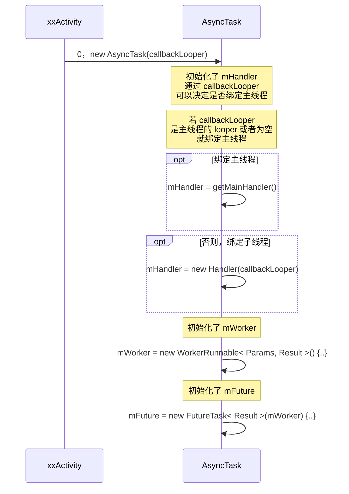

## 参考

[鸿洋_：Android AsyncTask 源码解析](https://blog.csdn.net/lmj623565791/article/details/38614699)

[刘望舒：Android多线程(二)AsyncTask源码分析](https://blog.csdn.net/itachi85/article/details/45041923/)

## 前言

AsyncTask 源码不复杂，参考了上述两篇文章基本讲清楚了，为了便于以后回顾整体流程，特意画了时序图（基于 mermaid 语法画时序图很方便！）

## 时序图

### 构造函数



小结1：创建 AsyncTask 的子类实例时，可以根据 callbackLooper 来决定 AsyncTask 的 mHandler 是否绑定主线程；<br>
换句话说，即的 onPostExecute、onProgressUpdate 函数在那个线程执行；<br>
mHandler 的类型 InternalHandler 的源码：<br>

```
// AsyncTask

    private static Handler getMainHandler() {
        synchronized (AsyncTask.class) {
            if (sHandler == null) {
                sHandler = new InternalHandler(Looper.getMainLooper());
            }
            return sHandler;
        }
    }
    
    private static class InternalHandler extends Handler {
        public InternalHandler(Looper looper) {
            super(looper);
        }

        @SuppressWarnings({"unchecked", "RawUseOfParameterizedType"})
        @Override
        public void handleMessage(Message msg) {
            AsyncTaskResult<?> result = (AsyncTaskResult<?>) msg.obj;
            switch (msg.what) {
                case MESSAGE_POST_RESULT:
                    // There is only one result
                    result.mTask.finish(result.mData[0]);
                    break;
                case MESSAGE_POST_PROGRESS:
                    result.mTask.onProgressUpdate(result.mData);
                    break;
            }
        }
    }
```

小结2：mWorker 的 call 函数调用了 doInBackground 函数；<br>
而 mWorker 的 call 函数在哪里执行就确定了 doInBackground 函数在那个线程执行；<br>
相关源码：

```
        mWorker = new WorkerRunnable<Params, Result>() {
            public Result call() throws Exception {
                mTaskInvoked.set(true);
                Result result = null;
                try {
                    Process.setThreadPriority(Process.THREAD_PRIORITY_BACKGROUND);
                    //noinspection unchecked
                    result = doInBackground(mParams);
                    Binder.flushPendingCommands();
                } catch (Throwable tr) {
                    mCancelled.set(true);
                    throw tr;
                } finally {
                    postResult(result);
                }
                return result;
            }
        };
```

小结3： mWorker 被封装在了 mFuture 内，所以后续看看 mFuture 在哪里被执行。
相关源码：

```
mFuture = new FutureTask<Result>(mWorker) {
            @Override
            protected void done() {
                try {
                    postResultIfNotInvoked(get());
                } catch (InterruptedException e) {
                    android.util.Log.w(LOG_TAG, e);
                } catch (ExecutionException e) {
                    throw new RuntimeException("An error occurred while executing doInBackground()",
                            e.getCause());
                } catch (CancellationException e) {
                    postResultIfNotInvoked(null);
                }
            }
        };
```


### 提交和执行任务

```mermaid
sequenceDiagram

xxActivity ->> AsyncTask: 0，new AsyncTask(callbackLooper)

xxActivity ->> AsyncTask: 1，execute(params)

activate AsyncTask

AsyncTask ->> AsyncTask: 2，executeOnExecutor(sDefaultExecutor, params)

activate AsyncTask

AsyncTask ->> AsyncTask: 3，onPreExecute()

AsyncTask ->> AsyncTask: mWorker.mParams = params;

opt 同步函数

note over AsyncTask: exec 就是 sDefaultExecutor

AsyncTask ->> SerialExecutor: 4，exec.execute(mFuture)

note over SerialExecutor: 定义一个 Runnable <br>和 run 函数 <br> tmp1 临时变量：

SerialExecutor ->> SerialExecutor: 5，tmp1 = new Runnable()：run(){...}


note over SerialExecutor: Runnable 入队：

SerialExecutor ->> SerialExecutor: 6，mTasks.offer( tmp1 )

note over SerialExecutor: if(mActive == null) <br>则调用：

SerialExecutor ->> SerialExecutor: 7，scheduleNext()

activate SerialExecutor

SerialExecutor ->> SerialExecutor: 8，mActive = mTasks.poll()

SerialExecutor ->> ThreadPoolExecutor: 9，THREAD_POOL_EXECUTOR.execute(mActive)

note over ThreadPoolExecutor: 正式的执行 Runnable

ThreadPoolExecutor ->> Runnable: 10，run

activate Runnable
Runnable ->> Runnable: 11，try：mFuture.run() 
note over ThreadPoolExecutor,Runnable: 任务执行完则再次调用：
Runnable ->> SerialExecutor: 12，finally：scheduleNext()

note over SerialExecutor: 重复第 7 步，<br>若 mTask 有元素<br>则继续执行

note over SerialExecutor: 由此可见，<br>是一个串行的方式在执行任务！

deactivate Runnable

deactivate SerialExecutor

end # opt 同步函数

AsyncTask ->> AsyncTask: return this

deactivate AsyncTask # end 2，executeOnExecutor
deactivate AsyncTask # end 1，execute(params)
```

小结：从 第7步 到 第12步，可以看出 AsyncTask 的串行执行原理，引用 [鸿洋_：Android AsyncTask 源码解析](https://blog.csdn.net/lmj623565791/article/details/38614699) 的解析：

> 可以看到，如果此时有10个任务同时调用execute（s synchronized）方法，第一个任务入队，然后在mActive = mTasks.poll()) != null（对应上述时序图的第8步）被取出，并且赋值给mActivte，然后交给线程池去执行。
> 
> 然后第二个任务入队，但是此时mActive并不为null，并不会执行scheduleNext();所以如果第一个任务比较慢，10个任务都会进入队列等待；**真正执行下一个任务的时机是，线程池执行完成第一个任务以后**，调用Runnable中的finally代码块中的scheduleNext，所以虽然内部有一个线程池，其实调用的过程还是线性的。一个接着一个的执行，相当于单线程。


### Future执行任务的细节

**注意，该图的第4步和第11步，对应了上图的第4步和第11步** <br>
**此图就是上图的第11步内的详细步骤展示**

```mermaid
sequenceDiagram

xxActivity ->> AsyncTask: new AsyncTask

AsyncTask ->> FutureTask: mFuture = new FutureTask< Result >(mWorker) {..}

activate FutureTask

FutureTask ->> FutureTask: this.callable = callable
FutureTask ->> FutureTask: this.state = NEW

deactivate FutureTask # end mFuture = new FutureTask

note right of AsyncTask: 线程池中排队，然后让<br> THREAD_POOL_EXECUTOR 执行

AsyncTask -->> FutureTask: 4，exec.execute(mFuture)

activate FutureTask

FutureTask ->> FutureTask: 11，run

activate FutureTask

FutureTask ->> FutureTask: 11-1，Callable< V > c = callable

FutureTask ->> WorkerRunnable: 11-2，result = c.call()

activate WorkerRunnable

WorkerRunnable ->> AsyncTask: 11-3，result = doInBackground(mParams)

note over AsyncTask: 在子线程执行 <br> doInBackground 函数

WorkerRunnable ->> AsyncTask: 11-4，finally postResult(result)

activate AsyncTask

AsyncTask ->> AsyncTask: message = getHandler().obtainMessage(<br>MESSAGE_POST_RESULT,<br>new AsyncTaskResult< Result >(this, result))

AsyncTask ->> AsyncTask: 11-6，message.sendToTarget()

note left of AsyncTask: 切换到主线程，执行 <br> onPostExecute 函数

deactivate AsyncTask

WorkerRunnable ->> FutureTask: 11-7，return result

deactivate WorkerRunnable # end 11-2 result = c.call()

FutureTask ->>+ FutureTask:  11-8，if (ran) set(result)

FutureTask ->>- FutureTask: 11-9，outcome = result

deactivate FutureTask # end run
deactivate FutureTask # end exec.execute(mFuture)
```

小结：<br>
图中展示了 AsyncTask 通过 FutureTask 和 WorkerRunnable， <br>在线程池中执行了 doInBackground 函数；<br>

得到 result 后，通过 handler 机制换回主线程执行 onPostExecute 函数的。<br>
其实，publishProgress 函数 也是同样的机制切换回值线程执行。源码：

```
// AsyncTask

    protected final void publishProgress(Progress... values) {
        if (!isCancelled()) {
            getHandler().obtainMessage(MESSAGE_POST_PROGRESS,
                    new AsyncTaskResult<Progress>(this, values)).sendToTarget();
        }
    }
```

再次回顾 InternalHandler 源码：

```
// AsyncTask

    private static Handler getMainHandler() {
        synchronized (AsyncTask.class) {
            if (sHandler == null) {
                sHandler = new InternalHandler(Looper.getMainLooper());
            }
            return sHandler;
        }
    }
    
    private static class InternalHandler extends Handler {
        public InternalHandler(Looper looper) {
            super(looper);
        }

        @SuppressWarnings({"unchecked", "RawUseOfParameterizedType"})
        @Override
        public void handleMessage(Message msg) {
            AsyncTaskResult<?> result = (AsyncTaskResult<?>) msg.obj;
            switch (msg.what) {
                case MESSAGE_POST_RESULT:
                    // There is only one result
                    result.mTask.finish(result.mData[0]);
                    break;
                case MESSAGE_POST_PROGRESS:
                    result.mTask.onProgressUpdate(result.mData);
                    break;
            }
        }
    }
```

更详细的源码解析，可参见上述两篇链接...
