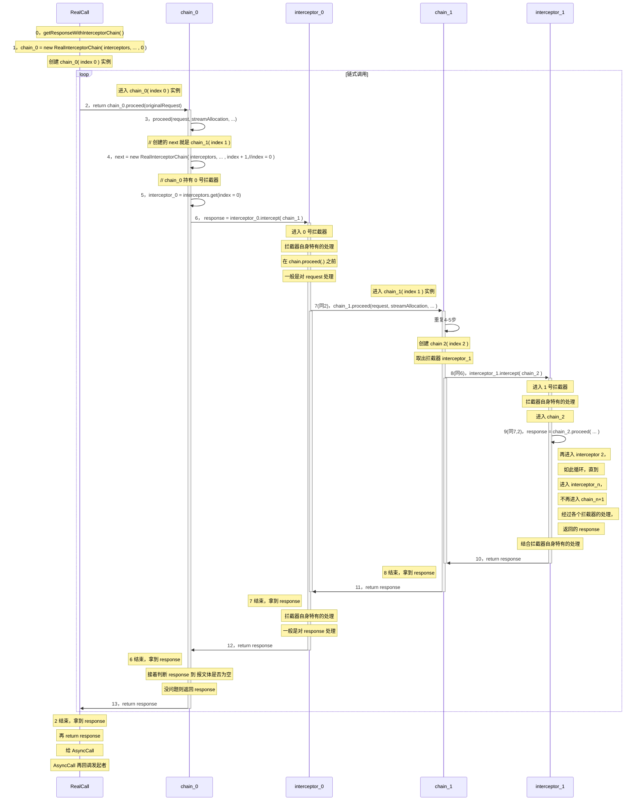

# OkHttp 框架-拦截器的链式调用

## 目录

[toc]

## 总流程

### 总流程时序图

参考源码为 OkHttp 3.11.0

```mermaid
sequenceDiagram

note right of OkHttpActivity: 第一步：
OkHttpActivity ->> OkHttpClient: 1，okHttpClient = new OkHttpClient()

OkHttpClient ->> OkHttpClient: OkHttpClient()
OkHttpClient ->> OkHttpClient: this(new Builder())
OkHttpClient ->> OkHttpActivity: return OkHttpClient 实例


note right of OkHttpActivity: 第二步：

OkHttpActivity ->> Request: 2，request = new Request.Builder().url(url)...build()


Request ->> Request: 3，url(String url) -- url(HttpUrl url)
activate Request
deactivate Request

Request ->> Request: 4，build()
activate Request

Request ->> OkHttpActivity: 5，return new Request(this)
deactivate Request

note right of OkHttpActivity: 第三步：
OkHttpActivity ->>+ OkHttpClient: 6，call = okHttpClient.newCall(request)

OkHttpClient ->>+ RealCall: 7，RealCall.newRealCall(this, request, false /* for web socket */)

note left of RealCall: this -> client
note left of RealCall: request -> originalRequest
note left of RealCall: false -> forWebSocket

RealCall ->> RealCall: 8，new RealCall( client, originalRequest, forWebSocket )

RealCall ->>- OkHttpClient: 9，return call

OkHttpClient ->>- OkHttpActivity: 10，return call

note right of OkHttpActivity: 第四步：
OkHttpActivity ->> RealCall: 11，call.enqueue(new Callback(){...})

# client.dispatcher().enqueue(new AsyncCall(responseCallback))

note left of RealCall: new Callback() 就是 responseCallback

RealCall ->> AsyncCall: client.dispatcher().enqueue(new AsyncCall(responseCallback))

note right of RealCall: client.dispatcher()：Dispatcher 类实例
note right of RealCall: AsyncCall 实例会被放入线程池


AsyncCall ->> AsyncCall: 12，execute
activate AsyncCall

AsyncCall ->> RealCall: 13，getResponseWithInterceptorChain()
activate RealCall

note left of RealCall: 添加若干拦截器：
note left of RealCall: ......
#note left of RealCall: interceptors = new ArrayList<>()
#note left of RealCall: interceptors.xxx(同下)
#note left of RealCall: addAll(client.interceptors());

#note left of RealCall: add(retryAndFollowUpInterceptor)

#note left of RealCall: add(new BridgeInterceptor(client.cookieJar()))

#note left of RealCall: add(new CacheInterceptor(client.internalCache()))

#note left of RealCall: add(new ConnectInterceptor(client))

#note left of RealCall: if (!forWebSocket) addAll(client.networkInterceptors())

note left of RealCall: 最后一个：add(new CallServerInterceptor(forWebSocket))

RealCall ->> RealCall: 14，chain = new RealInterceptorChain( interceptors...

note right of RealCall: 入参有：
note right of RealCall: interceptors
note right of RealCall: index = 0
#note right of RealCall: originalRequest
#note right of RealCall: callback = this
#note right of RealCall: eventListener
#note right of RealCall: client.connectTimeoutMillis()

RealCall ->> RealCall: 15，response = chain.proceed(originalRequest)

note right of RealCall: 经历一番链式调用
#note right of RealCall: 进入 RealInterceptorChain 类实例
#note right of RealCall: 执行 proceed(originalRequest) 函数 
#note right of RealCall: next = new RealInterceptorChain(... index + 1, ...
#note right of RealCall: interceptor = interceptors.get(index);
#note right of RealCall: response = interceptor.intercept(next);

RealCall ->> AsyncCall: 16，return response
deactivate RealCall

note left of AsyncCall: if 顺利响应
AsyncCall  ->>  OkHttpActivity : 17，responseCallback.onResponse(RealCall.this, response)

note left of AsyncCall: if catch (IOException e)
AsyncCall ->> OkHttpActivity : 18，responseCallback.onFailure(RealCall.this, e)

note left of AsyncCall: finally：
AsyncCall ->> AsyncCall: 19，client.dispatcher().finished(this);
deactivate AsyncCall # end 12

```

### 拦截器

上述的第13-16步，是 RealInterceptorChain 和 拦截器 interceptor 之间的一个链式调用，
RealCall 的 getResponseWithInterceptorChain() 函数内，会新建第一个 RealInterceptorChain 实例，然后开始链式调用，最后返回 respone；

```
// 代码段9
// RealCall.java

  Response getResponseWithInterceptorChain() throws IOException {
    // Build a full stack of interceptors.
    List<Interceptor> interceptors = new ArrayList<>();
    ......
    interceptors.add(new CallServerInterceptor(forWebSocket));

    Interceptor.Chain chain = new RealInterceptorChain(interceptors, null, null, null, 0,
        originalRequest, this, eventListener, client.connectTimeoutMillis(),
        client.readTimeoutMillis(), client.writeTimeoutMillis());

    return chain.proceed(originalRequest);
  }
```

其参数五 index 为 0，此处将该 RealInterceptorChain 实例称为 chain_0，意味着将从其参数一 interceptors 中取出下标为 0 的拦截器 interceptor_0，并委托其 intercept 函数拿到并返回 Response；而该 interceptor_0 的 intercept 函数内，又委托 chain_1 去拿到并返回 Response，而 chain_1 又会去委托 interceptor_1 去拿到并返回 Response，如此循环，直到某个 interceptor_n，不再委托 chain_n+1，而是在自己内部拿到 Response 并返回，则链式调用结束。

**这最后的 interceptor_n，就是 CallServerInterceptor.java。**

**chain_0 到 chain_n，都是 RealInterceptorChain 的实例**

**各个 interceptor 是包含了多种处理，chain 只是起到了承上启下的作用**

具体的过程时序图如下：

#### 拦截器的链式调用时序图



<br>
最后一个拦截器是：CallServerInterceptor.java
该拦截器没有进入下一个 chain，相关的关键源码：

```
Response response = responseBuilder
        .request(request)
        .handshake(streamAllocation.connection().handshake())
        .sentRequestAtMillis(sentRequestMillis)
        .receivedResponseAtMillis(System.currentTimeMillis())
        .build();
```

<br>

#### 拦截器小结

默认带有的拦截器如下：

```
// RealCall.java

  Response getResponseWithInterceptorChain() throws IOException {
    // Build a full stack of interceptors.
    List<Interceptor> interceptors = new ArrayList<>();
    interceptors.addAll(client.interceptors());
    interceptors.add(retryAndFollowUpInterceptor);
    interceptors.add(new BridgeInterceptor(client.cookieJar()));
    interceptors.add(new CacheInterceptor(client.internalCache()));
    interceptors.add(new ConnectInterceptor(client));
    if (!forWebSocket) {
      interceptors.addAll(client.networkInterceptors());
    }
    interceptors.add(new CallServerInterceptor(forWebSocket));

    Interceptor.Chain chain = new RealInterceptorChain(interceptors, null, null, null, 0,
        originalRequest, this, eventListener, client.connectTimeoutMillis(),
        client.readTimeoutMillis(), client.writeTimeoutMillis());

    return chain.proceed(originalRequest);
  }
```

<br>

引用 [okhttp源码解析 by json_it学习笔记](https://blog.csdn.net/json_it/article/details/78404010) 流程图：


<br>

越早执行的拦截器，越晚返回；反之，越晚执行的拦截器，越早返回；

其中最晚执行的拦截器是 CallServerInterceptor.java，其作用就是进行网络通信，发送请求，结束响应的；

将其放在最后执行，使得其他拦截器可以在请求前和响应后，加上自己的处理；

自定义的普通拦截器，会最早执行，最晚返回；

自定义的网络拦截器，对应的 networkInterceptors ；只在 CallServerInterceptor 之前执行；

<br>

再引用 [OkHttp 3.7源码分析（二）——拦截器&一个实际网络请求的实现](https://yq.aliyun.com/articles/78104?spm=a2c4e.11153940.0.0.38455d13pDmpUz) 的图：


<br>

## 拓展之拦截器

[okhttp源码解析 by json_it学习笔记](https://blog.csdn.net/json_it/article/details/78404010)，这里比较详细解析了 RetryAndFollowUpInterceptor、CacheInterceptor 、ConnectInterceptor（重点在于线程池的解析） 这三个拦截器，没有说 CallServerInterceptor；

引用：

> Connections：连接远程服务器的物理连接；
> 
Streams：基于Connection的逻辑Http请求/响应对。一个连接可以承载多少个Stream都是有限制的，Http1.x连接只能承载一个Stream，而一个Http2.0连接可以承载多个Stream（支持并发请求，并发请求共用一个Connection）；

> Calls：逻辑Stream序列，典型的例子是一个初始请求及其后续的请求。We prefer to keep all streams of a single call on the same  connection for better behavior and locality.
> 
> 对于同步和异步请求，唯一的区别就是异步请求会放在线程池（ThreadPoolExecutor）中去执行，而同步请求则会在当前线程中执行，注意：同步请求会阻塞当前线程。
> 
> 对于Http1.1，call - 1:1 - Stream - 1:1 - connection;
> 
> 对于http2.0,call - 1:1 - Stream - N:1 - connection;
> 
> 由上述流程图，我们可以直观的了解到一次基本的请求包括如下两个部分：call+interceptors。
> 
> call:最终的请求对象；
> 
> interceptors:这是OkHttp最核心的部分，一个请求会经过OkHttp的若干个拦截器进行处理，每一个拦截器都会完成一个功能模块，比如CacheInterceptor完成网络请求的缓存。一个Request经过拦截器链的处理之后，会得到最终的Response。
> interceptors里面包括的东西很多东西，后续的源码分析就是以拦截器为主线来进行分析。
