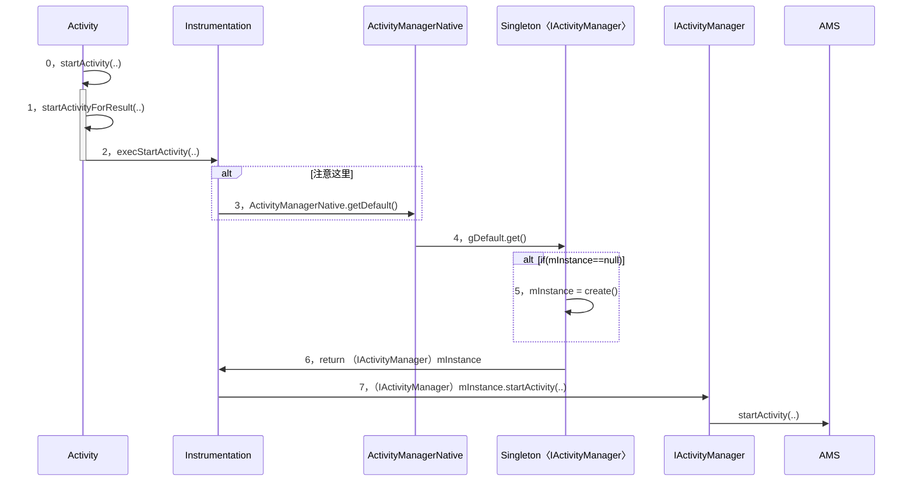
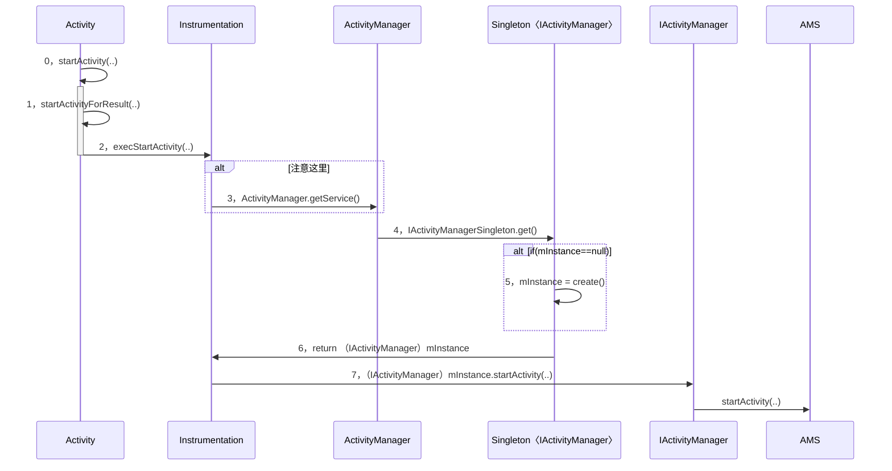

# Hook 7.0/8.0 IactivityManager 的对比梳理

[toc]

## 时序图对比

### 7.0 获取 IActyMgr 的时序图



<br> 
### 8.0 获取 IActyMgr 的时序图



<br> 

由上述两图对比，可知整体流程大致相同，最终想要替换的就是第5-7步的 IActivityManager，并 Hook 其 startActivity 函数；

其中它们的第3步的角色不一样，第4步的引用名不一样；这就使得需用使用 Hook 和 动态代理 两者结合的方式更为合理。hook 的代码示例：

### 兼容的 hook 的代码示例

```
    public static void hookAMS() throws Exception {
    
        Object defaultSingleton=null;
        
        if (Build.VERSION.SDK_INT >= 26) { 
            
            // 8.0 
            // 第3步角色为 ActivityManager 的类
            Class<?> activityManageClazz = Class.forName("android.app.ActivityManager");
            
            // 第一次静态反射 getField
            // 拿到静态字段 IActivityManagerSingleton 的引用值
            // 对应第4步的 Singleton〈IActivityManager〉的实例
            defaultSingleton=  FieldUtil.getField(activityManageClazz ,null,"IActivityManagerSingleton");
            
        } else { 
        
            // 7.0 
            // 第3步角色为 ActivityManagerNative 的类
            Class<?> activityManagerNativeClazz = Class.forName("android.app.ActivityManagerNative");
            
            // 第一次静态反射 getField
            // 拿到静态字段 gDefault 的引用值
            // 对应第4步的 Singleton〈IActivityManager〉的实例
            defaultSingleton=  FieldUtil.getField(activityManagerNativeClazz,null,"gDefault");
        }
        
        // 从此开始，defaultSingleton 就是第4步的 Singleton〈IActivityManager〉的实例
        
        // 拿到第4步的 Singleton〈IActivityManager〉的类
        Class<?> singletonClazz = Class.forName("android.util.Singleton");
        
        // 第二次静态反射 getField
        // 类 + 字段名，得到字段域
        // 得到第4步的 Singleton〈IActivityManager〉的类字段域 mInstance
        Field mInstanceField= FieldUtil.getField(singletonClazz ,"mInstance");
        
        // 第一次动态反射 get
        // 类字段域 + 类实例，得到字段引用值
        // 反射得到字段 mInstanceField 的引用值
        // 对应第5-7步的 IActivityManager 实例
        Object iActivityManager = mInstanceField.get(defaultSingleton);
        
        // 得到第5-7步的 IActivityManager 的类
        Class<?> iActivityManagerClazz = Class.forName("android.app.IActivityManager");
        
        // 新建动态代理角色
        Object proxy = Proxy.newProxyInstance(Thread.currentThread().getContextClassLoader(),
                new Class<?>[] { iActivityManagerClazz }, new IActivityManagerProxy(iActivityManager));
         
        // 第一次动态反射 set     
        // 类字段域 + 类实例 + 替换的对象引用
        // 反射替换实例中的字段域的引用值
        // 替换的是第4步的 Singleton〈IActivityManager〉的实例的字段 mInstance 的值
        // 即第5-7步的 IActivityManager 实例被替换成 proxy   
        mInstanceField.set(defaultSingleton, proxy);
        
        LogUtil.e("HookAMS 完成");
    }
``` 

看完代码，可知替换的是 defaultSingleton 实例中的字段 mInstance 的引用值；

**而 defaultSingleton 实例在 7.0 和 8.0 系统中是不一样的，所以才需要用动态代理！**

如果 defaultSingleton 实例在7.0 和 8.0 系统中是一样的，用静态代理需要怎样做？

答：拿到 mInstance 字段引用实例的类型，实现一个拓展类（拓展类实例中持有原类实例，可调用原类函数），然后替换为其拓展类即可！

<br> 
## 源码细节

### 7.0 的 Instrumentation#execStartActivity

```
// frameworks/base/core/java/android/app/Instrumentation.java

public ActivityResult execStartActivity(
            Context who, IBinder contextThread, IBinder token, Activity target,
            Intent intent, int requestCode, Bundle options) {
      ...
        try {
            intent.migrateExtraStreamToClipData();
            intent.prepareToLeaveProcess(who);
            int result = ActivityManagerNative.getDefault()
                .startActivity(whoThread, who.getBasePackageName(), intent,
                        intent.resolveTypeIfNeeded(who.getContentResolver()),
                        token, target != null ? target.mEmbeddedID : null,
                        requestCode, 0, null, options);
            checkStartActivityResult(result, intent);
        } catch (RemoteException e) {
            throw new RuntimeException("Failure from system", e);
        }
        return null;
    }
```

### 8.0 的 Instrumentation#execStartActivity

```
// frameworks/base/core/java/android/app/Instrumentation.java

public ActivityResult execStartActivity(
          Context who, IBinder contextThread, IBinder token, Activity target,
          Intent intent, int requestCode, Bundle options) {
      ...
      try {
          intent.migrateExtraStreamToClipData();
          intent.prepareToLeaveProcess(who);
          int result = ActivityManager.getService()
              .startActivity(whoThread, who.getBasePackageName(), intent,
                      intent.resolveTypeIfNeeded(who.getContentResolver()),
                      token, target != null ? target.mEmbeddedID : null,
                      requestCode, 0, null, options);
          checkStartActivityResult(result, intent);
      } catch (RemoteException e) {
          throw new RuntimeException("Failure from system", e);
      }
      return null;
  }
```

再看

7.0 的 ActivityManagerNative.getDefault() 

8.0 的 ActivityManager.getService() 

的区别：

### 7.0 的 ActivityManagerNative.getDefault()

```
// frameworks/base/core/java/android/app/ActivityManagerNative.java

  static public IActivityManager getDefault() {
        return gDefault.get();
    }

    private static final Singleton<IActivityManager> gDefault = new Singleton<IActivityManager>() {
        protected IActivityManager create() {
            IBinder b = ServiceManager.getService("activity");//1
            if (false) {
                Log.v("ActivityManager", "default service binder = " + b);
            }
            IActivityManager am = asInterface(b);//2
            if (false) {
                Log.v("ActivityManager", "default service = " + am);
            }
            return am;
        }
    };
}
```

<br>
### 8.0 的 ActivityManager.getService() 


```
// frameworks/base/core/java/android/app/ActivityManager.java

public static IActivityManager getService() {
       return IActivityManagerSingleton.get();
   }

   private static final Singleton<IActivityManager> IActivityManagerSingleton =
           new Singleton<IActivityManager>() {
               @Override
               protected IActivityManager create() {
                   final IBinder b = ServiceManager.getService(Context.ACTIVITY_SERVICE);//1
                   final IActivityManager am = IActivityManager.Stub.asInterface(b);//2
                   return am;
               }
           };
```

<br>
### 7.0 和 8.0 的 Singleton 一样

```
// frameworks/base/core/java/android/util/Singleton.java

public abstract class Singleton<T> {
    private T mInstance;

    protected abstract T create();

    public final T get() {
        synchronized (this) {
            if (mInstance == null) {
                mInstance = create();
            }
            return mInstance;
        }
    }
}
```